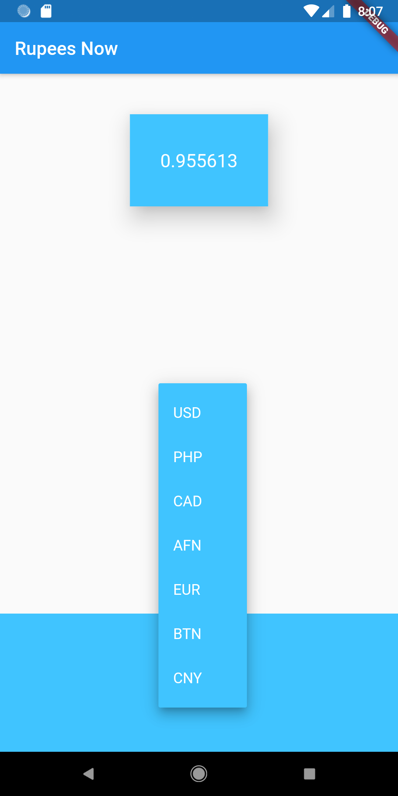

# Rupees Now
A simple application that will provide you the current rate of Indian Rupee against other currencies of the world.

This application is a part of a course - <a href="https://www.youtube.com/playlist?list=PLjC8JXsSUrrhTkfCs3P_Gp_Q31YFravzm">Flutter in Hindi</a>

<h2> Screenshots -</h2> 

